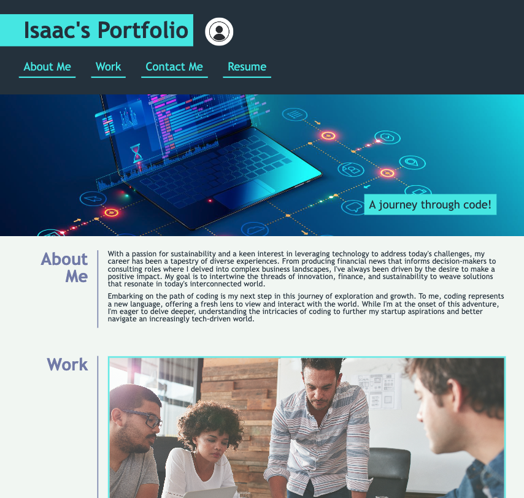

# Isaac's Portfolio

## Description

This portfolio showcases my work as a developer, providing potential employers with a glimpse into my skills, projects, and background. 

- **Motivation**: My motivation for creating this portfolio was to have a centralized platform where I can showcase my skills, projects, and achievements to potential employers.
- **Purpose**: This project serves as a testament to my coding abilities and provides a space where I can highlight my best work.
- **Problem it Solves**: It offers a quick and easy way for potential employers to view my work samples, thus aiding in their hiring decisions.
- **What I Learned**: Through the process of building this portfolio, I honed my skills in HTML, CSS, and responsive design. I also learned the importance of presenting information in a clear and organized manner.

## Installation

To view the portfolio, simply navigate to the deployed website. For a local copy, clone the repository and open the `index.html` file in a web browser.

## Usage

Visit the deployed website: [Isaac's Portfolio](https://isaacmasterman.github.io/M02C-Portfolio/)

Here are some screenshots of the portfolio:

## Credits

- The `reset.css` was sourced from the Week 2 Day 3 materials of the EdX Coding Bootcamp Course.
- I received assistance for the media queries from Juan Delgado, a tutor in the EdX Coding Bootcamp.

## License

This project is licensed under the MIT License.